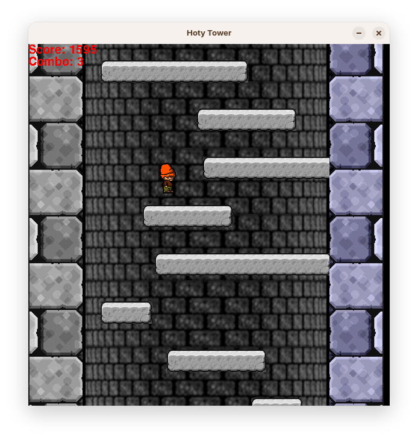

<div align="center">

# 🗼 Endless Jumper RL

[](https://www.python.org/downloads/)
[](https://pytorch.org/)
[](https://www.pygame.org/)

*An Icy Tower–inspired endless jumper used as a testbed for benchmarking three agent strategies: **PPO**, **NeuroEvolution**, and a **simple heuristic** - all solving the same game.*



</div>

---

## 🎮 The Game

The environment is a faithful re-implementation of the core mechanics of Icy Tower, based on the details described in the [original Icy Tower Wiki](https://icytower.fandom.com/wiki/Icy_Tower_Wiki):

- Character acceleration and momentum-based horizontal movement
- Jump height calculated from momentum - build up speed before you jump
- Wall bounce physics for chaining jumps off the side walls
- Score tracking with a combo system that rewards fast, consecutive climbs
- Screen scrolling that accelerates with elapsed time

The game is fully decoupled from rendering, so agents can train headless at full speed - and rendering can be switched on at any time to watch a trained agent play.

---

## 🤖 The Three Approaches

All agents share the same observation and action space for a fair comparison: a **30-dimensional state** (normalized player position, velocities, airborne flag, jump charge, plus a field of view of up to 8 nearby platforms) and **4 actions** (left, right, jump, no-op).

### 1. 📈 PPO

An actor-critic agent trained with Proximal Policy Optimization - clipped surrogate objective, GAE advantage estimation, on-policy learning from a continuous interaction stream with the environment, plus an entropy bonus for exploration.

### 2. 🧬 NeuroEvolution

A population-based genetic algorithm that evolves neural network weights directly - elitism with a Hall of Fame that is always re-inserted into the population, Gaussian weight mutation, and fitness averaged over multiple random platform seeds per generation to avoid overfitting to a single map. Evaluation runs massively parallel across CPU cores.

### 3. 📏 Simple Heuristic

A hand-crafted, rule-based policy with no learning at all. It reads the game state and the nearest reachable platform, then picks one of a set of scripted macro-moves (jump left/right, straight jump, small hops, wait). It serves as a sanity-check baseline: if a learned agent can't beat it, something is wrong.

---

## 👀 Watching a Trained Agent

Each training script logs per-episode scores and combos and exports a CSV + chart, so the three approaches can be compared directly on peak and mean score, combo frequency, and robustness across random platform seeds. Trained checkpoints can be replayed at any time to watch an agent play in real time.

---

## 🏋️ How to Run

Before the first run, install the dependencies:

```bash
pip install pygame torch numpy pandas matplotlib
```

### Training

Each algorithm has its own entry-point script, run from the repository root:

```bash
python train.py        # NeuroEvolution
python train_ppo.py    # PPO
python heuristic_algorithm.py    # Simple heuristic
```

Training runs headless (no game window) for maximum speed, logs progress live to the console, and saves the best checkpoints to the `model/` directory automatically. PPO additionally exports a CSV file with a chart of scores and combos per episode.

### Watching a trained agent

```bash
python watch.py
```

`watch.py` loads a saved checkpoint and renders the game in real time so you can see the agent play. Use the `PPO` / `EVO` selector at the top of the script to switch between the PPO and NeuroEvolution models.

---

## ⚙️ Requirements

- Python 3.10+
- `pygame`
- `torch`
- `numpy`, `pandas`, `matplotlib`